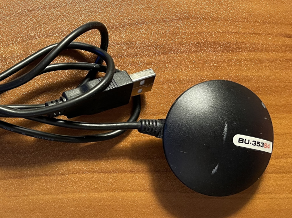
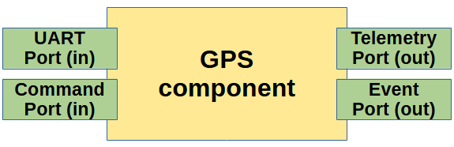
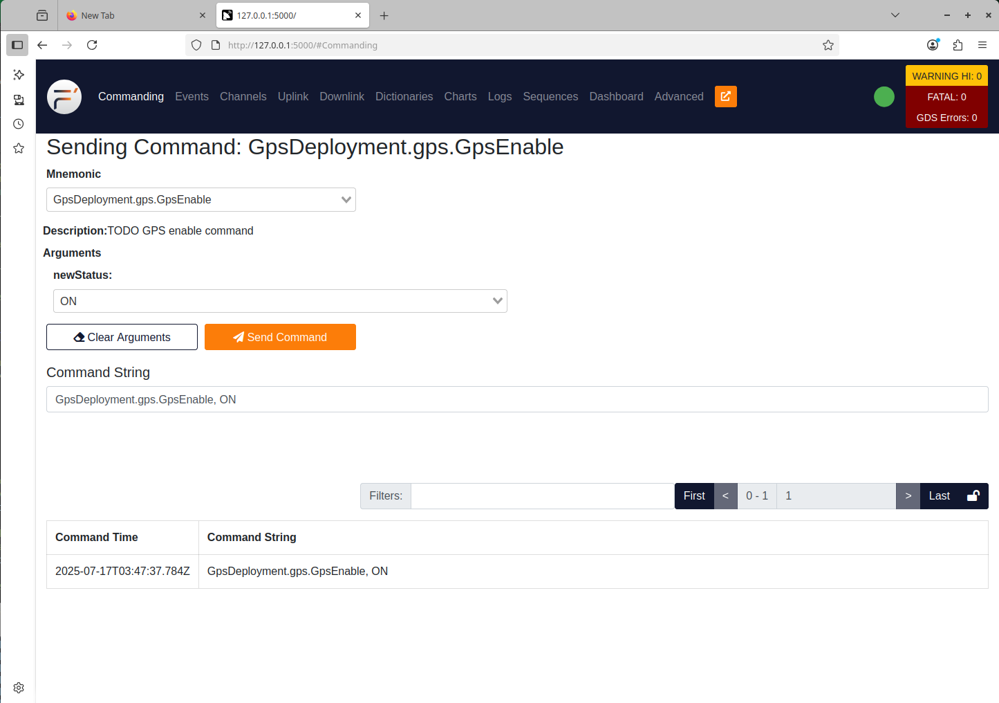
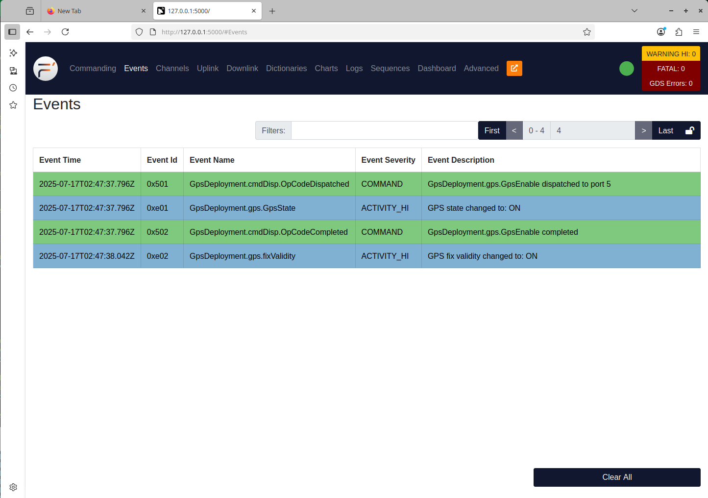
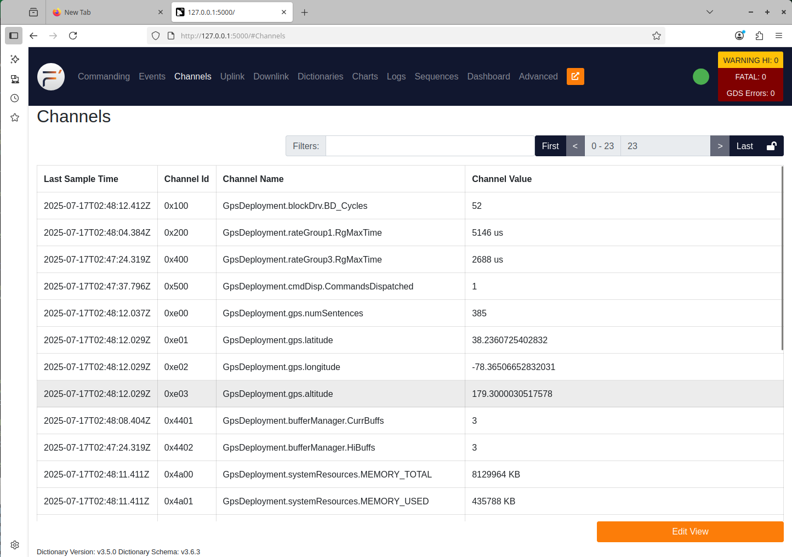

# F´ GPS Tutorial

This tutorial will show how to integrate a GPS receiver with
the F´ framework by wrapping it in a Component that defines commands,
telemetry, and log events. We will create a deployment for the
Component in which it will be wired to a standard UART driver in order to
receive NMEA sentences. We will build and test it against the F´ GDS ground system.

_[This tutorial has been updated for F' v4.0.]_

## Prerequisites

This tutorial assumes you have gone through and understand the 
HelloWorld Tutorial 
<https://fprime.jpl.nasa.gov/latest/tutorials-hello-world/docs/hello-world/> 
and the MathComponent Tutorial 
<https://fprime.jpl.nasa.gov/latest/tutorials-math-component/docs/math-component/>.

This tutorial also requires you to have some basic software skills and
to have installed F´. The prerequisite skills to understand this tutorial
are:

 1. Working knowledge of Unix; how to navigate in a shell and execute
    programs
 2. An understanding of C++, including class declarations and inheritance

In order to fully benefit from this tutorial, you 
should acquire a GPS receiver connected to the host computer via UART 
(or USB that appears as a 
/dev/ttyxxx).  The GPS receiver should emit standard NMEA sentences 
on this tty device.



Installation of F' can be done by following the instructions in the 
HelloWorld Tutorial 
https://fprime.jpl.nasa.gov/latest/tutorials-hello-world/docs/hello-world/.
That tutorial will
walk you through the installation process and verify the
installation.

For the rest of this tutorial we'll assume you named your project **GpsProject**.

## Creating a Custom F´ Component

In this next section, we will create a custom F´ component for reading
GPS data from a UART-based GPS module. Our component will receive data from a 
UART port, process the data, and report telemetry from that data. We
will then finish up by adding an event to report GPS lock status when it
changes and a command to enable and disable the GPS device.

Our custom component has the following functional block diagram:



*Note: While there are a few other ports our component will need to wire to
other components in the system, the above diagram captures the ports
specific for our desired functionality.*

## Designing the GPS Component

F’ designs are specified in FPP files that are processed by code
generators (autocoders) to create C++ source and header files. Component, Port, 
Command, Event, and Telemetry Channel specifications are
all written in FPP. Further information is in the full F´ 
User Manual <https://fprime.jpl.nasa.gov/latest/docs/user-manual/>. This
application does not need any custom ports, as we are using standard
ports to create our GPS handler. Custom ports can be seen in the Math
Component Tutorial <https://fprime.jpl.nasa.gov/latest/docs/tutorials/>.

In this section, we will initialize our GPS component and
design it using FPP. The first step in creating the component
is to make and initialize a component subdirectory for our GPS.

**In: GpsProject/Components/**
```
fprime-util new --component
[INFO] Cookiecutter source: using builtin
  [1/8] Component name (MyComponent): Gps
  [2/8] Component short description (Component for F Prime FSW framework.): Component to read and process NMEA sentences from a UART-attached GPS receiver
  [3/8] Component namespace (Components): Gps
  [4/8] Select component kind
    1 - active
    2 - passive
    3 - queued
    Choose from [1/2/3] (1): 
  [5/8] Enable Commands?
    1 - yes
    2 - no
    Choose from [1/2] (1): 
  [6/8] Enable Telemetry?
    1 - yes
    2 - no
    Choose from [1/2] (1): 
  [7/8] Enable Events?
    1 - yes
    2 - no
    Choose from [1/2] (1): 
  [8/8] Enable Parameters?
    1 - yes
    2 - no
    Choose from [1/2] (1): 
[INFO] Found CMake file at 'gps-tutorial/Components/CMakeLists.txt'
Add Gps to gps-tutorial/Components/CMakeLists.txt at end of file? (yes/no) [yes]:
Generate implementation files? (yes/no) [yes]: yes
```
Before doing anything with the files we have just generated, let's try building:
**In: GpsProject/Components/Gps/**
```
fprime-util build
```
There should be no errors.

## Editing the FPP Model

Now we have a generic F' component that builds but does nothing useful.
To turn it into a working component, we will edit the FPP file to 
guide the autocoder in creating the .cpp and .hpp files that will do the work.
All the standard elements will already be defined, so we just need to add the 
elements specific to the _Gps_ component.

Open ```Gps.fpp``` and replace the line ```async command TODO opcode 0```
with:

**In: GpsProject/Components/Gps/Gps.fpp**
```
        @ GPS enable command
        async command GPSEnable(newStatus: Fw.On) opcode 0

        @ Count the number of NMEA sentences received
        telemetry numSentences: U32
        @ GGA latitude
        telemetry latitude: F64
        @ GGA longitude
        telemetry longitude: F64
        @ GGA altitude
        telemetry altitude: F64

        @ GPS receiver state: enabled or disabled
        event GpsState(enabled: Fw.On) severity activity high id 1 format "GPS state changed to: {}"
        @ GPS fix validity: valid or invalid
        event fixValidity(valid: Fw.On) severity activity high id 2 format "GPS fix validity changed to: {}"

        @ Port to receive GPS data
        async input port GPSRecv: Drv.ByteStreamData
        @ Port to send GPS commands
        output port GPSSend: Drv.ByteStreamSend
        @ Port to return buffers for deallocation
        output port deallocate: Fw.BufferSend
```
Run the autocoder by typing ```fprime-util impl```.  It should run with no errors,
and will generate two template files.  Use those template files to replace the 
original .hpp and .cpp files, then run ```fprime-util build```.
**In: GpsProject/Components/Gps/**
```
fprime-util impl
mv Gps.template.hpp Gps.hpp
mv Gps.template.cpp Gps.cpp
fprime-util build
```
Again, there should be no errors.  This is all boilerplate code so far.  
If there are errors, go back and look at your FPP file for typos.

## Coding Our Component

Now it's time to code our module to read from the GPS hardware and downlink
the GPS telemetry. This is where the F' framework will help us
considerably. In addition to the two template files we just renamed, the
autocoder has also generated several _*Ac.?pp_ files (in the 
_build-*_ tree, not here in the source directory), which handle the work of
constructing ports, allowing us to write minimal code to support the
component interface. 

**Note: When we regenerate the templates later to reflect changes 
in the FPP file, we must be careful 
to not overwrite already implemented code by merely copying the new templates to
the implementation files.**

## Implementation

In the generated implementations, we can see two places marked "// TODO". 
We need to implement a function called ```GpsRecv_handler``` to read and 
process the GPS NMEA sentences, and a function called  
```GpsEnable_cmdHandler``` to handle the enable/disable command.  
A number of functions are provided in those 
```*Ac.?pp``` files for us to use when we implement these two sections 
of our code.  Those available functions are described below:

 1. ```log_ACTIVITY_HI_gpsState```: used to emit the event 
    ```gpsState```
 2. ```log_ACTIVITY_HI_fixValidity```: used to emit the event 
    ```fixValidity```
 3. ```tlmWrite_latitude```: used to send the telemetry ```latitude``` 
    telemetry
 4. ```tlmWrite_longitude```: used to send the telemetry ```longitude``` telemetry
 5. ```tlmWrite_altitude```: used to send the telemetry ```altitude``` telemetry
 6. ```cmdResponse_out```: used to report the end of command processing.  

In order to make a GPS processor that works, we need to code the 
following capabilities:

 1. Configure the buffer manager to provide buffers to the UART driver
 2. Implement the GpsRecv_handler function (called by the UART
    driver with one of the above buffers)
 3. Parse the GPS NMEA sentences
 4. Return the buffers to the buffer manager for deallocation
 5. Downlink telemetry
 6. If GPS lock status has changed, log an event describing the change
 7. Respond to the commandHandler with a ```cmdResponse_out``` call

These steps are included in the example implementations of these two
files shown below. 

**Note: This is a quick-and-dirty parser implementation.  It doesn't 
account for sentence format variations and is full of unhandled edge cases, and so 
is not suitable for use in any real application.  It is only for 
demonstrating integration of a GPS receiver into an F' project.**

### GpsProject/Components/Gps/Gps.hpp (Sample)

```
// ======================================================================
// \title  Gps.hpp
// \author Michael Starch and Mike McPherson
// \brief  hpp file for Gps component implementation class
// 
// The F' component implements a GPS receiver that processes NMEA 
// sentences.  It handles GPS data reception, parsing, and provides 
// commands to enable/disable GPS functionality. The component maintains 
// state variables for Gps status, fix validity, and geographic 
// coordinates.  It also provides telemetry outputs for GPS data.
// ======================================================================

#ifndef Gps_Gps_HPP
#define Gps_Gps_HPP

#include "Components/Gps/GpsComponentAc.hpp"

namespace Gps {

class Gps final : public GpsComponentBase {
  public:

  /**
       * GpsPacket:
       *   A structure containing the information in the GPS location packet
       * received via the NMEA GPS receiver.
       */
      struct GpsPacket {
          char constellation;
          float utcTime;
          float dmNS;
          char northSouth;
          float dmEW;
          char eastWest;
          unsigned int lock;
          unsigned int count;
          float filler;
          float altitude;
      } m_packet;

    // ----------------------------------------------------------------------
    // Component construction and destruction
    // ----------------------------------------------------------------------

    //! Construct Gps object
    Gps(const char* const compName  //!< The component name
    );

    //! Destroy Gps object
    ~Gps();

  private:

    char m_sentenceBuffer[128] = {0}; //!< Buffer for NMEA sentences
    U32 m_sentenceBufferIndex = 0; //!< Pointer to the current position in the sentence buffer
    U32 m_numSentences = 0; //!< Number of sentences received
    U32 m_locked = 0; //!< GGA GPS Quality
    Fw::On m_GpsEnabled = Fw::On::OFF; //!< Gps enabled flag
    Fw::On m_fixValid = Fw::On::OFF; //!< Valid fix flag

  private:
    // ----------------------------------------------------------------------
    // Handler implementations for typed input ports
    // ----------------------------------------------------------------------

    //! Handler implementation for GpsRecv
    //!
    //! Port to receive GPS data
    void GpsRecv_handler(FwIndexType portNum,  //!< The port number
                         Fw::Buffer& recvBuffer,
                         const Drv::ByteStreamStatus& recvStatus) override;

  private:
    // ----------------------------------------------------------------------
    // Handler implementations for commands
    // ----------------------------------------------------------------------

    //! Handler implementation for command GpsEnable
    //!
    //! GPS enable command
    void GpsEnable_cmdHandler(FwOpcodeType opCode,  //!< The opcode
                              U32 cmdSeq,           //!< The command sequence number
                              Fw::On newStatus) override;
};

}  // namespace Gps

#endif
```
### GpsProject/Components/Gps/Gps.cpp (Sample)
```
// ======================================================================
// \title  Gps.cpp
// \author Michael Starch and Mike McPherson
// \brief  cpp file for Gps component implementation class
//
// The F' component implements a GPS receiver that processes NMEA 
// sentences.  It handles GPS data reception, parsing, and provides 
// commands to enable/disable GPS functionality. The component maintains 
// state variables for Gps status, fix validity, and geographic 
// coordinates.  It also provides telemetry outputs for GPS data.
// ======================================================================

#include "Components/Gps/Gps.hpp"
#include "Fw/Logger/Logger.hpp"
#include "Fw/Time/Time.hpp"

namespace Gps {

// ----------------------------------------------------------------------
// Component construction and destruction
// ----------------------------------------------------------------------

Gps ::Gps(const char* const compName) : GpsComponentBase(compName) 

  {
      m_numSentences = 0; //!< Number of NMEA sentences received
      memset(m_sentenceBuffer, 0, sizeof(m_sentenceBuffer));
  }

Gps ::~Gps() {}

// ----------------------------------------------------------------------
// Handler implementations for typed input ports
// ----------------------------------------------------------------------

void Gps ::GpsRecv_handler(
    FwIndexType portNum, 
    Fw::Buffer& recvBuffer, 
    const Drv::ByteStreamStatus& recvStatus) 
  {
      // Check the receive status
      if(recvStatus == Drv::ByteStreamStatus::RECV_NO_DATA)
      {
        // Handle no data case
        Fw::Logger::log("No data received on port %d\n", portNum);
        this->deallocate_out(0, recvBuffer);// Return the buffer to the deallocate port
        return;
      } else if(recvStatus != Drv::ByteStreamStatus::OP_OK)
      {
        // Handle error case
        Fw::Logger::log("Receive error on port %d, recvStatus: %d\n", portNum, recvStatus);
        this->deallocate_out(0, recvBuffer);// Return the buffer to the deallocate port
        return;
      }

      // Is the Gps enabled?
      if (m_GpsEnabled != Fw::On::ON) {
        this->deallocate_out(0, recvBuffer);// Return the buffer to the deallocate port
        return;
      }

      // Process the NMEA data
      U32 m_bufferSize = recvBuffer.getSize();// How many bytes were received?
      char* m_data_pointer = reinterpret_cast<char*>(recvBuffer.getData());// Get the data pointer from the buffer
      for (U32 i = 0; i < m_bufferSize && i < sizeof(m_sentenceBuffer) - 1; i++) {
        m_sentenceBuffer[m_sentenceBufferIndex] = m_data_pointer[i];// Copy the received data into the sentence buffer
        m_sentenceBufferIndex++;// Increment the pointer to the next position
        // If we have reached the end of an NMEA sentence, process it
        if(m_data_pointer[i] == '\n') {
          m_sentenceBuffer[m_sentenceBufferIndex] = '\0';// Null-terminate the sentence buffer
          m_sentenceBufferIndex++;// Increment the sentence buffer index
          m_numSentences++;// Increment the number of sentences received
          this->tlmWrite_numSentences(m_numSentences);// Update telemetry

          // Parse the GPS message from the UART (looking for $GPGGA messages). This uses standard C functions to read all
          // the defined protocol messages into our GPS package struct.
          U32 status = sscanf(m_sentenceBuffer, "$G%1cGGA,%f,%f,%c,%f,%c,%u,%u,%f,%f",
              &m_packet.constellation,
              &m_packet.utcTime, &m_packet.dmNS, &m_packet.northSouth,
              &m_packet.dmEW, &m_packet.eastWest, &m_packet.lock,
              &m_packet.count, &m_packet.filler, &m_packet.altitude);
          // If we failed to find the G?GGA then move on to the next sentence.
          if (status != 10) {
            // Log an error if parsing failed
            Fw::Logger::log("[ERROR] GPS parsing failed: %d\n", status);
            m_sentenceBufferIndex = 0; //!< Reset the sentence buffer index
            continue;
          }
          //GPS packet locations are of the form: ddmm.mmmm
          //We will convert to lat/lon in degrees only before downlinking
          //Latitude degrees, add on minutes (converted to degrees), multiply by direction
          F32 lat = (U32)(m_packet.dmNS/100.0f);
          lat = lat + (m_packet.dmNS - (lat * 100.0f))/60.0f;
          lat = lat * ((m_packet.northSouth == 'N') ? 1 : -1);
          //Longitude degrees, add on minutes (converted to degrees), multiply by direction
          F32 lon = (U32)(m_packet.dmEW/100.0f);
          lon = lon + (m_packet.dmEW - (lon * 100.0f))/60.f;
          lon = lon * ((m_packet.eastWest == 'E') ? 1 : -1);
          //Step 4: call the downlink functions to send down data
          this->tlmWrite_latitude(lat);
          this->tlmWrite_longitude(lon);
          this->tlmWrite_altitude(m_packet.altitude);
          //Lock status update only if changed
          // Emit an event if the lock has been acquired, or lost
          if (m_packet.lock > 0 && m_packet.lock < 4)
          {
            m_packet.lock = 1;
          } else
          {
            m_packet.lock = 0;
          }
          if (m_packet.lock == 0 && m_locked == Fw::On::ON) {
              m_locked = Fw::On::OFF; // Set GPS lock flag to OFF
              m_fixValid = Fw::On::OFF; // Set fix validity to OFF
              this->log_ACTIVITY_HI_fixValidity(m_fixValid);
          } else if (m_packet.lock == 1 && m_locked == Fw::On::OFF) {
              m_locked = Fw::On::ON; // Set GPS lock flag to ON
              m_fixValid = Fw::On::ON; // Set fix validity to ON
              this->log_ACTIVITY_HI_fixValidity(m_fixValid);
          }
          // Reset the pointer to the start of the sentence buffer
          m_sentenceBufferIndex = 0;
        }
      }
      // Return the buffer to the deallocate port
      this->deallocate_out(0, recvBuffer);
  }

// ----------------------------------------------------------------------
// Handler implementations for commands
// ----------------------------------------------------------------------

  void Gps ::GpsEnable_cmdHandler(
      FwOpcodeType opCode, 
      U32 cmdSeq, 
      Fw::On newStatus) 
  {
      // Save the new Gps enabled status
      m_GpsEnabled = newStatus;
      if(m_GpsEnabled == Fw::On::OFF) {
        // Reset to default values when Gps is disabled
        // And update telemetry and logs
        m_locked = 0; // Reset GPS lock status
        m_fixValid = Fw::On::OFF; // Reset fix validity
        this->log_ACTIVITY_HI_fixValidity(m_fixValid); // Log fix validity
        m_numSentences = 0; // Reset the number of sentences
        this->tlmWrite_numSentences(m_numSentences); // Update telemetry
        this->tlmWrite_latitude(0.0); // Update telemetry
        this->tlmWrite_longitude(0.0); // Update telemetry
        this->tlmWrite_altitude(0.0); // Update telemetry
      }
      // Log the Gps state change
      this->log_ACTIVITY_HI_GpsState(m_GpsEnabled);
      this->cmdResponse_out(opCode, cmdSeq, Fw::CmdResponse::OK);
  }

}  // namespace Gps
```
After making the changes to "Gps.hpp" and "Gps.cpp" so they match 
the examples above, run ```fprime-util build``` to build our component.  
There should be no errors, but if there are this is the time to 
fix them. We’ll now integrate our component into a new deployment.

**In: GpsProject/Components/Gps/**
```
fprime-util build
```
## Ready to deploy

We are ready to create a deployment to connect the GPS component 
to the standard F´ components. 

There are many components that come “for free” from F'. 
We will make sure that all of our ports for the Gps component exist 
and have been connected to the correct ports on standard F'
components. This involves two steps:

 1. Instantiate ```LinuxUartDriver``` and ```Gps``` components
 2. Add new port connections to wire the ```Gps``` and ```LinuxUartTDriver```

We’ll work through these steps below.

## Create a new deployment

Create a new deployment, accepting the defaults in all cases.

**In: GpsProject/**
```
fprime-util new --deployment
[INFO] Cookiecutter: using builtin template for new deployment
  [1/2] Deployment name (MyDeployment): GpsDeployment
  [2/2] Select communication driver type
    1 - TcpClient
    2 - TcpServer
    3 - UART
    Choose from [1/2/3] (1): 
[INFO] Found CMake file at 'gps-tutorial/project.cmake'
Add GpsDeployment to gps-tutorial/project.cmake at end of file? (yes/no) [yes]:
[INFO] New deployment successfully created: /home/kq9p/fprime-community/gps-tutorial/GpsDeployment
```
Name this deployment _GpsDeployment_.

**In: GpsProject/GpsDeployment/**
```
fprime-util build
```
If there are any errors, address them before proceeding.

## Adding our component to the deployment

Now we will add our new component to this deployment by editing the FPP 
model files ```instances.fpp``` and ```topology.fpp```.  These two files 
describe the components that make up the deployment, how they are configured, 
how they are scheduled, and how they are connected to each other.

**In: GpsProject/GpsDeployment/Top/instances.fpp, at the end of the section "Active component instances" add:**
```
  @ GPS component instance
  instance gps: Gps.Gps base id 0x0E00 \
    queue size Default.QUEUE_SIZE \
    stack size Default.STACK_SIZE \
    priority 95
```

**In the section "Passive component instances", replace:**
```
instance bufferManager: Svc.BufferManager base id 0x4400
```
**with:**
```
  instance bufferManager: Svc.BufferManager base id 0x4400 \
  {
    phase Fpp.ToCpp.Phases.configComponents """
    Fw::MallocAllocator m_allocator;
    Svc::BufferManager::BufferBins bufferManagerBins;
    memset(&bufferManagerBins, 0, sizeof(bufferManagerBins));
    {
      bufferManagerBins.bins[0].bufferSize = 1024;
      bufferManagerBins.bins[0].numBuffers = 100;
      bufferManager.setup(
          200,
          0,
          m_allocator,
          bufferManagerBins
      );
    }
    """
  }
```
We will be using the _bufferManager_ F' service to manage buffer 
allocation and deallocation for the UART driver and our new 
component.  This block of C++ code tells _bufferManager_ what 
to expect.

**At the end of the section "Passive component instances", add:**
```
  @ UART driver instance. Configured to use a Linux UART driver
  instance uartDrv: Drv.LinuxUartDriver base id 0x0F00 \
  {

    phase Fpp.ToCpp.Phases.configComponents """
      const bool status = uartDrv.open("/dev/ttyACM0",
          Drv::LinuxUartDriver::BAUD_9600,
          Drv::LinuxUartDriver::NO_FLOW,
          Drv::LinuxUartDriver::PARITY_NONE,
          1024
      );
      if (status) 
      {
        printf("Successfully opened UART driver\\n");
        uartDrv.start();
      } else 
      {
        printf("[ERROR]: Could not open UART driver\\n");
      }
    """

    phase Fpp.ToCpp.Phases.stopTasks """
    uartDrv.quitReadThread();
    """

  }
```
We'll be using the F' standard driver LinuxUartDriver to handle 
the UART.  This block of C++ code tells the driver how to open the UART, 
provides some status messages, and tells the driver how to exit when finished.

**Note: This is where you change the name of the UART device to match your system.**

**In: GpsProject/GpsDeployment/Top/topology.fpp, at the end of the section "Instances used in the topology, insert:**
```
    instance bufferManager
    @ UART driver instance. Configured to use a Linux UART driver
    instance uartDrv
    @ GPS component instance
    instance gps
```
These lines will cause copies of '''bufferManager''', ```LinuxUartDriver```, and our ```gps``` 
component to be instantiated at runtime.

**At the end of the section "Direct graph specifiers", edit the "GpsDeployment" entry so it looks like:**
```
    @ Connections for the GPS component
    @ Connect uartDrv.allocate to bufferManager.bufferGetCallee to get buffers for GPS data
    @ Connect gps.deallocate to bufferManager.bufferSendIn to send buffers back after processing
    @ Connect uartDrv.$recv to gps.gpsRecv to receive GPS data
    @ Connect gps.gpsSend to uartDrv.$send to send GPS data
    connections gpsDeployment {
      uartDrv.allocate -> bufferManager.bufferGetCallee
      gps.deallocate -> bufferManager.bufferSendIn
      uartDrv.$recv -> gps.gpsRecv
      gps.gpsSend -> uartDrv.$send
    }
```
Build and fix errors, should there be any.

**In: GpsProject/GpsDeployment/**
```
fprime-util build
```
## Trying it out

Run the F' GDS ground system by typing:
```
fprime-gds
```
GDS will automatically launch our deployment and open a browser window 
with the GDS interface.  You should see a page that looks something like:



Select the "gpsEnable" command and set the GPS state to "ON".

On the "Events" page you should see:



And on the "Channels" page you should see several new telemetry channels 
generated by our GPS component.  If the GPS receiver is working you should 
see the position and altitude changing, and the number of sentences should 
be climbing steadily.



When you are finished experimenting with your new toy, ensure the ground 
system and flight software have been stopped
by using _CTRL-C_ to kill the processes.

## Conclusion

This GPS Tutorial has shown us how to create a component that 
supports a very common hardware device used in almost every mission.  
We have seen how to add components and wire them to existing drivers, 
and we’ve seen how to run the ground system and collect data from 
our new component.  

**Well done!**

Thanks to all those who've worked on this tutorial over the years:
Joshua-Anderson, r9-pena, LeStarch, and thomas-bc.

© 2025 California Institute of Technology. Government sponsorship
acknowledged.
